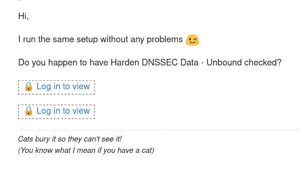
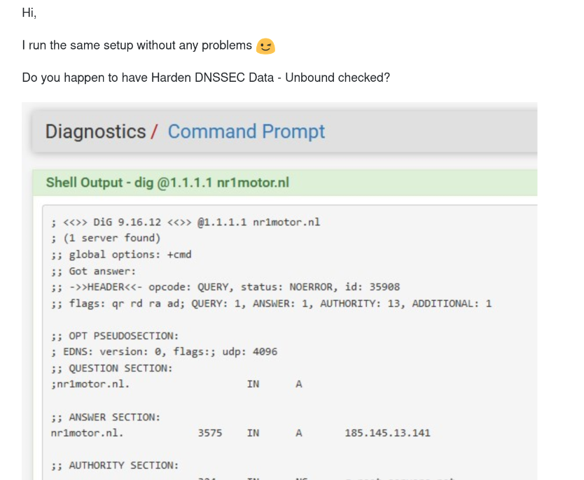
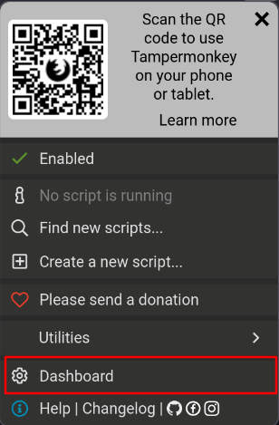
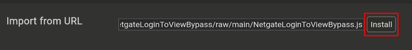

# NetgateLoginToViewBypass

## Description

Replaces "Log in to view" links with their images on forum.netgate.com.

### Before

### After

## Installation

1. Install the Tampermonkey extension
2. Open the **Dashboard**
   1. 
3. Click the **Utilities** tab
4. Copy and paste the following into **Import from URL** and click **Install**
   1. `https://github.com/SolidGoat/NetgateLoginToViewBypass/raw/main/NetgateLoginToViewBypass.js`
   2. 
